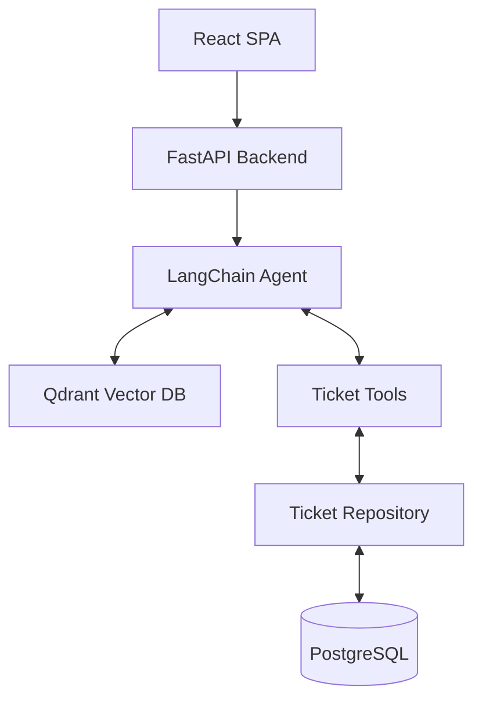

# Enterprise AI Copilot

An autonomous, B2B AI Assistant engineered for internal Tier-1 IT and HR support. 

## Problem
Internal IT and HR teams are often bottlenecked by repetitive Tier-1 support requests (e.g., "How do I reset my VPN?", "What is the onboarding policy?", "What is the status of ticket #123?"). Traditional static chatbots fail because they cannot reason about complex user intent or autonomously execute backend actions.

This project solves this by implementing a **Retrieval-Augmented Generation (RAG)** pipeline combined with a **ReAct Agent architecture**, allowing the LLM to search enterprise knowledge bases and autonomously interact with internal ticketing systems.

## Architecture
The system is fully decoupled into a React SPA, a FastAPI backend, a Qdrant vector store, and a PostgreSQL relational database. The backend strictly follows a Repository/Service layered architecture.



## Features
- **Semantic RAG Search**: Vector search against Qdrant using OpenAI embeddings to retrieve relevant documentation.
- **Agentic Tool Use**: The LLM autonomously triggers backend tools (`create_ticket`, `get_ticket_status`, `escalate_to_human`).
- **Enterprise Security**: Custom Rate Limiter middleware, Prompt Injection filtering, and strict CORS configuration.
- **Exception Handling**: Global exception handler standardizing all API responses to a strict JSON schema.
- **Admin Dashboard**: Real-time management interface for IT Admins to monitor, update, and reply to agent-created tickets.

## Observability & Performance Metrics
Thanks to our integration with LangSmith and Celery, this application provides production-level observability:
- **Thought Process Tracking**: Every decision the AI makes (which tools it called, the exact prompts used, and the outputs returned) is tracked live in the LangSmith dashboard. You are never "flying blind."
- **Background Processing**: When uploading a 50-page PDF, the document is chunked and embedded in the background via a Celery worker. The API returns instantly, guaranteeing a smooth user experience.

### Expected System Latency
The architecture is designed for high-performance enterprise workloads. Typical latency benchmarks:
- **Frontend / UI Navigation**: `< 50ms` (React SPA)
- **Standard API Calls** (Ticket creation/updates): `< 100ms` (FastAPI + PostgreSQL)
- **Vector Semantic Search**: `< 50ms` (Qdrant)
- **Agentic Chat (Time-to-First-Token)**: `~1.5s` (Dependent on OpenAI API and LangGraph routing)
- **Document Ingestion**: `0ms API blocking` (Delegated to Celery workers for async processing)

## Tech Stack
*   **Frontend**: React, Vite, Tailwind CSS, Framer Motion
*   **Backend**: Python, FastAPI, LangChain, SQLAlchemy
*   **Databases**: PostgreSQL (Relational), Qdrant (Vector)
*   **Infrastructure**: Docker, NGINX

## Folder Structure
```text
enterprise-copilot/
├── app/
│   ├── routers/        # FastAPI route controllers
│   ├── services/       # Business logic layer
│   ├── repositories/   # Raw database queries
│   ├── tools.py        # LangChain LLM Tool definitions
│   ├── agent.py        # ReAct Agent compilation
│   └── vector_store.py # Qdrant embedding/search logic
├── frontend/
│   ├── src/
│   │   ├── components/ # React components (chat, admin)
│   │   └── App.jsx     # Main SPA router
│   └── Dockerfile      # NGINX production build
├── tests/              # Pytest integration tests
├── docs/               # Architecture markdown documentation
├── docker-compose.yml  # Full stack orchestration
└── Dockerfile          # Python backend build
```

## Setup

The application is fully containerized.

1. **Clone the repository**:
   ```bash
   git clone https://github.com/your-username/enterprise-copilot.git
   cd enterprise-copilot
   ```

2. **Configure Environment Variables**:
   Create a `.env` file in the root directory:
   ```env
   OPENAI_API_KEY=sk-...
   LLM_MODEL=gpt-4o-mini
   POSTGRES_USER=admin
   POSTGRES_PASSWORD=admin
   POSTGRES_DB=copilot
   ```

3. **Run via Docker Compose**:
   ```bash
   docker-compose up -d --build
   ```

The Frontend will be available at `http://localhost:3000` and the API at `http://localhost:8000/docs`.

## API

All API endpoints return a standardized JSON schema:
```json
{
  "status": "success",
  "data": { ... }
}
```

### Key Endpoints
*   `POST /chat` - Submit a message to the AI Agent.
*   `GET /admin/tickets` - Retrieve all support tickets.
*   `PUT /admin/tickets/{ticket_id}` - Update the status of a specific ticket.

*(For full interactive documentation, visit `http://localhost:8000/docs` after booting the server).*

## Screenshots
*(Insert screenshot of the Dark Mode React UI here)*

## Demo
*(Insert link to a Loom video or hosted demo here)*

## Known Limitations
- RAG chunking currently relies on `RecursiveCharacterTextSplitter`; semantic or document-aware chunking is not yet implemented.
- The `TicketService` currently uses synchronous SQLAlchemy calls instead of `asyncpg`.
- Multi-modal support (images/PDFs) is stubbed but lacks true Vision LLM integration.

## Future Work
- **Phase 5**: Implement stateless JWT Authentication and RBAC (Role-Based Access Control).
- **Phase 6**: Implement Hybrid Search (Dense + Sparse vectors) to improve retrieval accuracy.
- **Phase 7**: Integrate Prometheus and Grafana for system observability.
